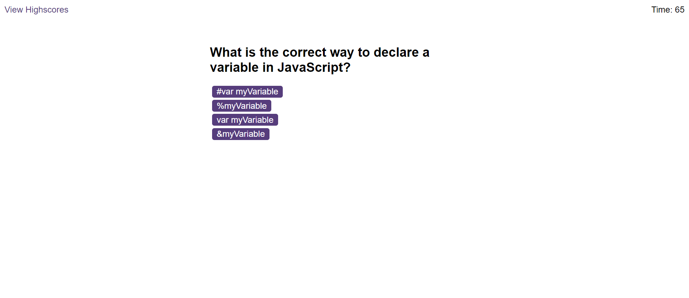
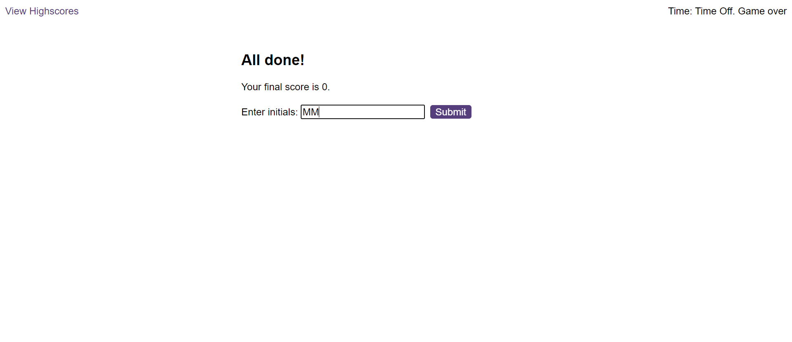
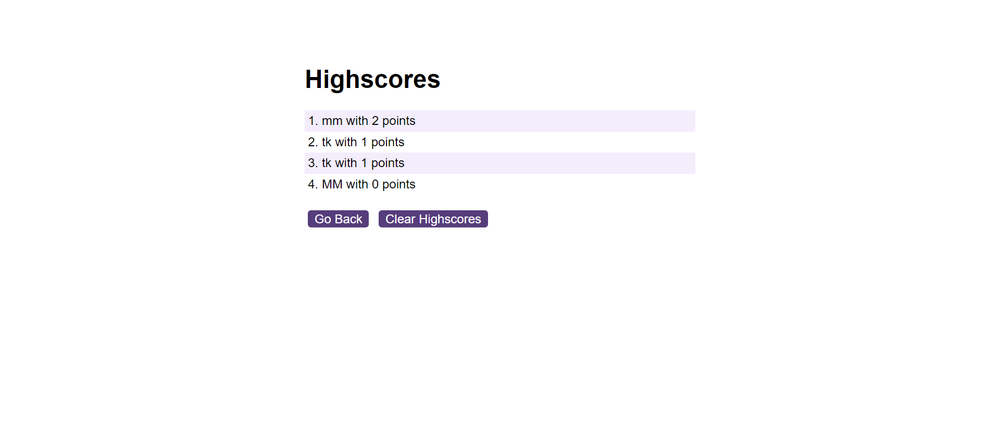

# easy-coding-quizz

## Project description
A combination of multiple-choice questions and interactive coding Challenges.

## Instructions

User Story
AS A coding boot camp student
I WANT to take a timed quiz on JavaScript fundamentals that stores high scores
SO THAT I can gauge my progress compared to my peers

Acceptance Criteria
Create a code quiz that contains the following requirements:
- A start button that when clicked a timer starts and the first question appears.
- Questions contain buttons for each answer.
- When answer is clicked, the next question appears
- If the answer clicked was incorrect then subtract time from the clock
- The quiz should end when all questions are answered or the timer reaches 0.
- When the game ends, it should display their score and give the user the ability to save their initials and their score

## Usage
To view the final results, you will need to open the page in the browser [Deployed Quizz landing page](https://maudmain.github.io/APIs-coding-quizz/).

The landing page displays the quiz rules and a Start Quizz button. 

Click on the button to start the game, it will display the first question, click on the answer.
- if correct, it will move to the next question 
- if incorrect, it will deduct five second from the timer and move to the next question

Once all questions are answered, the end-screen is displayed, showing the final results and prompting the user to enter their initial to store their result on the highscrore page.

On the highscore page, you will be able to see the results stored locally. You will be able to see how you have improved your score. This is stored locally, to reset the log click on the clear Highscores button.
 

## Credit

- edX Bootcamp: for project brief and criterias, tutorial and ressources provided during this week's course 
- T-L-K for his help undestanding and white-boarding the concepts for this challenge

What I have learned/ Resources:
- [array.prototype.forEach()](https://developer.mozilla.org/en-US/docs/Web/JavaScript/Reference/Global_Objects/Array/forEach)
- [document.createElement()](https://developer.mozilla.org/en-US/docs/Web/API/Document/createElement )
- [setInterval()](ttps://developer.mozilla.org/en-US/docs/Web/API/setInterval )
-[Nullish coalescing operator (??)](https://developer.mozilla.org/en-US/docs/Web/JavaScript/Reference/Operators/Nullish_coalescing)
- [addEventListener()](https://developer.mozilla.org/en-US/docs/Web/API/EventTarget/addEventListener)
- [Element: click event](https://developer.mozilla.org/en-US/docs/Web/API/Element/click_event)
- [localStorage](https://developer.mozilla.org/en-US/docs/Web/API/Window/localStorage)
- [JSON.parse()](https://developer.mozilla.org/en-US/docs/Web/JavaScript/Reference/Global_Objects/JSON/parse)
- [JSON.stringify()](https://developer.mozilla.org/en-US/docs/Web/JavaScript/Reference/Global_Objects/JSON/stringify)
- [Optional chaining (?.)](https://developer.mozilla.org/en-US/docs/Web/JavaScript/Reference/Operators/Optional_chaining)

## License
  MIT